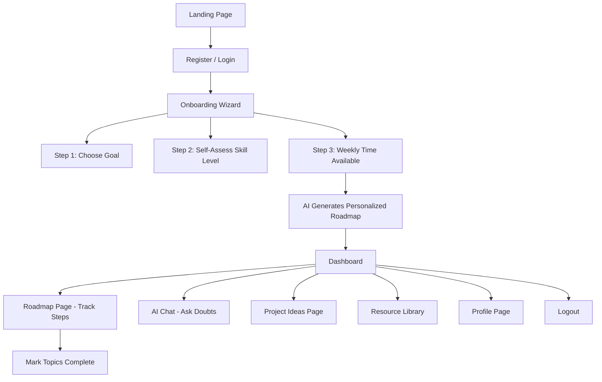
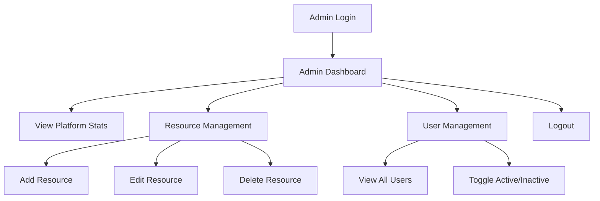

# 🎯 SkillPath AI — Frontend

> **AI-Powered Personalized Learning & Project Guidance Platform**
> Frontend built with **React.js** — part of a full-stack MERN + AI project.

[](https://react.dev/)
[](https://vitejs.dev/)
[](#-license)
[](#-sdg-alignment)

---

## 📖 Table of Contents

1. [About the Project](#-about-the-project)
2. [SDG Alignment](#-sdg-alignment)
3. [Problem It Solves](#-problem-it-solves)
4. [How It Works (User Flow)](#-how-it-works-user-flow)
5. [Features](#-features)
6. [Tech Stack](#-tech-stack)
7. [Architecture Overview](#-architecture-overview)
8. [Folder Structure](#-folder-structure)
9. [Getting Started](#-getting-started)
10. [Environment Variables](#-environment-variables)
11. [Available Scripts](#-available-scripts)
12. [Roadmap / Future Scope](#-roadmap--future-scope)
13. [Contributing](#-contributing)
14. [License](#-license)

---

## 🧠 About the Project

**SkillPath AI** is a full-stack, AI-powered learning platform that acts like a **personal AI mentor** for every learner. Instead of leaving students to figure out *what* to learn and *in what order* — a problem that causes most self-learners to quit — SkillPath AI:

- Understands a student's **goal** and **current skill level**
- Generates a **personalized, step-by-step learning roadmap** using AI (Groq)
- Lets students **chat with an AI mentor** whenever they're stuck
- Recommends **real project ideas** matching their current stage
- Tracks their **progress visually** on a dashboard

> Think of it like Duolingo's "streak & path" system — but for *any* tech skill, and personalized by AI instead of a fixed course.

This repository contains the **frontend (React.js)** of the platform. A companion backend README will describe the Node.js/Express API layer.

---

## 🌍 SDG Alignment

**SDG 4 — Quality Education**
> *"Ensure inclusive and equitable quality education and promote lifelong learning opportunities for all."*

| Target | How SkillPath AI Addresses It |
|--------|-------------------------------|
| **4.4** | Helps youth and adults build relevant technical skills for employment/entrepreneurship through structured, personalized roadmaps |
| **4.b** | Expands access to free, self-paced learning pathways — no paid mentorship required |

---

## ❗ Problem It Solves

Imagine two students who want to "become a web developer":

```
❌ WITHOUT SkillPath AI                    ✅ WITH SkillPath AI
─────────────────────────                 ─────────────────────────
"Where do I even start?"                  Takes a 3-step onboarding quiz
Googles "how to learn coding"             AI generates a custom roadmap
100 tabs open, no structure               Follows a clear, ordered path
Doesn't know if they're ready to build    Gets AI-recommended projects
Gets stuck, nobody to ask                 Asks the AI mentor instantly
Loses motivation → quits (90%+ dropout)   Tracks progress → stays motivated
```

**Why it matters:** over 800 million youth globally lack digital/employable skills (UNESCO), and most free platforms are one-size-fits-all rather than personalized to the learner.

---

## 🔄 How It Works (User Flow)

### Student Journey



**Step-by-step:**

| Step | Screen | What Happens |
|------|--------|---------------|
| 1 | **Landing Page** | Hero section + "Start Learning Free" call-to-action |
| 2 | **Register/Login** | Email + password (or Google OAuth) |
| 3 | **Onboarding Wizard** | 3 quick steps: goal → skill level → time available |
| 4 | **AI Roadmap Generation** | Groq AI builds a custom roadmap, saved to the dashboard |
| 5 | **Dashboard** | Shows progress %, today's topic, recent chat, quick links |
| 6 | **Roadmap Page** | Full step-by-step timeline; mark steps complete; regenerate anytime |
| 7 | **AI Chat** | Real-time Q&A with the AI mentor, saved to history |
| 8 | **Project Ideas** | AI-recommended projects matched to the student's current level |
| 9 | **Resource Library** | Curated articles/videos, browsable by topic |
| 10 | **Profile** | Edit personal info and view account stats |

### Admin Flow



---

## ✨ Features

### 🌐 Public (No Login Required)

| Feature | What It Does |
|---------|---------------|
| **Landing Page** | Hero section, feature highlights, testimonials |
| **About Page** | Project mission and SDG alignment |
| **Public Demo Roadmap** | A sample AI roadmap visible without signing up |
| **Login / Register** | Email + password, optional Google OAuth |

### 🎓 Student Features

| Feature | What It Does |
|---------|---------------|
| **Onboarding Quiz** | Captures goal, skill level, and time availability |
| **Personal Dashboard** | Central hub: roadmap, progress, recent activity |
| **AI Roadmap View** | Step-by-step personalized learning plan |
| **Roadmap Regeneration** | Rebuild the roadmap if the goal changes |
| **Progress Tracker** | Check off completed topics, see % complete |
| **Project Ideas Page** | AI-recommended, level-matched project suggestions |
| **AI Doubt Chat** | Real-time conversational help, 24/7 |
| **Resource Library** | Curated learning links and videos |
| **Profile Page** | Update name, avatar, and goals |
| **Chat History** | Revisit previous AI conversations |

### 🛠️ Admin Features

| Feature | What It Does |
|---------|---------------|
| **Admin Dashboard** | Platform-wide stats (users, roadmaps, chats) |
| **Resource Management** | Add/edit/delete curated resources |
| **User Management** | View users, toggle active/inactive |
| **Roadmap Monitoring** | See roadmap generation activity |

### 🤖 AI-Powered (surfaced in the UI)

| Feature | What It Does |
|---------|---------------|
| **AI Roadmap Generator** | Builds the personalized plan (Groq API) |
| **AI Doubt Assistant** | Answers student questions conversationally |
| **Project Recommender** | Suggests projects based on current skill level |
| **Fallback Handling** | Frontend gracefully displays a rule-based roadmap if the AI service is down |

---

## 🧰 Tech Stack

```
┌─────────────────────────────────────────────┐
│                FRONTEND STACK                │
├─────────────────────────────────────────────┤
│  React.js 18        → Component-based UI     │
│  React Router DOM v6 → Client-side routing    │
│  Axios              → API calls to backend    │
│  React Context API  → Global state (auth)     │
│  CSS Modules         → Scoped styling         │
│  React Icons         → Icon library           │
│  Recharts            → Dashboard charts       │
│  Framer Motion       → Animations             │
│  React Hot Toast     → Notifications          │
│  Vite                → Build tool / dev server│
└─────────────────────────────────────────────┘
```

| Tool | Purpose | Why It Was Chosen |
|------|----------|-------------------|
| **React.js 18** | UI library | Component-based, fast re-renders, industry standard |
| **React Router DOM v6** | Routing | Client-side navigation with nested layouts |
| **Axios** | HTTP client | Clean, promise-based API for calling the backend |
| **React Context API** | State management | Simple global state (auth/user) without Redux overhead |
| **CSS Modules / Custom CSS** | Styling | Scoped, beginner-friendly styling |
| **React Icons** | Icons | Lightweight, comprehensive icon set |
| **Recharts** | Data visualization | Renders progress charts on the dashboard |
| **Framer Motion** | Animation | Smooth micro-interactions for a premium feel |
| **React Hot Toast** | Notifications | Elegant success/error toasts |
| **Vite** | Tooling | Fast dev server and optimized builds |

**Deployment:** [Vercel](https://vercel.com) (automatic CI/CD from GitHub)

---

## 🏗️ Architecture Overview

```
┌────────────┐      HTTPS/JSON       ┌────────────┐      ┌──────────────┐
│            │  ───────────────────▶ │            │      │              │
│  React     │                        │  Express   │ ───▶ │  MongoDB     │
│  Frontend  │ ◀───────────────────  │  Backend   │      │  Atlas       │
│  (Vercel)  │      Axios calls       │  (Render)  │      │              │
└────────────┘                        └─────┬──────┘      └──────────────┘
                                             │
                                             ▼
                                       ┌────────────┐
                                       │  Groq AI   │
                                       │  (LLM API) │
                                       └────────────┘
```

The frontend never talks to the AI directly — all AI requests (roadmap generation, chat, project recommendations) are proxied through the backend, which handles authentication, rate-limiting, and fallback logic.

---

## 📁 Folder Structure

```
skillpath-ai-frontend/
├── public/                  # Static assets (favicon, images)
├── src/
│   ├── assets/               # Images, icons, illustrations
│   ├── components/           # Reusable UI components
│   │   ├── common/            # Buttons, inputs, modals, loaders
│   │   ├── dashboard/         # Dashboard-specific widgets
│   │   ├── roadmap/           # Roadmap timeline components
│   │   └── chat/              # AI chat UI components
│   ├── context/               # React Context (AuthContext, UserContext)
│   ├── hooks/                 # Custom hooks (useAuth, useFetch, etc.)
│   ├── pages/                 # Route-level pages
│   │   ├── Landing.jsx
│   │   ├── Login.jsx
│   │   ├── Register.jsx
│   │   ├── Onboarding.jsx
│   │   ├── Dashboard.jsx
│   │   ├── Roadmap.jsx
│   │   ├── AIChat.jsx
│   │   ├── Projects.jsx
│   │   ├── Resources.jsx
│   │   ├── Profile.jsx
│   │   └── admin/
│   ├── services/               # Axios API service functions
│   ├── utils/                  # Helper functions
│   ├── App.jsx                 # Root component + routing
│   └── main.jsx                # Entry point
├── .env.example
├── package.json
└── README.md
```

---

## 🚀 Getting Started

### Prerequisites

- **Node.js** v18+ (LTS recommended)
- **npm** v9+
- A running instance of the [SkillPath AI backend](#) (see backend README)

### Installation

```bash
# 1. Clone the repository
git clone https://github.com/<your-username>/skillpath-ai-frontend.git
cd skillpath-ai-frontend

# 2. Install dependencies
npm install

# 3. Set up environment variables
cp .env.example .env
# then fill in the values (see below)

# 4. Start the development server
npm run dev
```

The app will be available at **http://localhost:5173** (default Vite port).

---

## 🔐 Environment Variables

Create a `.env` file in the project root:

```env
VITE_API_BASE_URL=http://localhost:5000/api
VITE_GOOGLE_CLIENT_ID=your-google-oauth-client-id   # optional, if using Google login
```

| Variable | Description |
|-----------|-------------|
| `VITE_API_BASE_URL` | Base URL of the backend API |
| `VITE_GOOGLE_CLIENT_ID` | Google OAuth client ID (optional) |

> ⚠️ Never commit your real `.env` file. Only `.env.example` should be tracked in Git.

---

## 📜 Available Scripts

| Command | What It Does |
|---------|---------------|
| `npm run dev` | Starts the local development server with hot reload |
| `npm run build` | Creates an optimized production build in `dist/` |
| `npm run preview` | Serves the production build locally for testing |
| `npm run lint` | Runs ESLint to check code quality |

---

## 🔮 Roadmap / Future Scope

These features are intentionally out of scope for the current version but planned for later:

| Feature | Why It's Deferred |
|---------|--------------------|
| **Peer Learning Groups** | Requires complex real-time architecture |
| **Gamification / Badges** | Can be layered on post-MVP |
| **Video Lesson Embedding** | Content licensing complexity |
| **Job Board Integration** | Needs a third-party API |
| **Certificate Generation** | PDF rendering complexity |
| **Mobile App (React Native)** | Out of scope for this MERN-focused build |

---

## 🤝 Contributing

Contributions are welcome!

1. Fork the repository
2. Create a feature branch: `git checkout -b feature/your-feature-name`
3. Commit your changes: `git commit -m "Add: your feature"`
4. Push to the branch: `git push origin feature/your-feature-name`
5. Open a Pull Request

---

## 📄 License

This project is licensed under the **MIT License** — see the `LICENSE` file for details.

---

<p align="center">Built with ❤️ to make quality tech education accessible to everyone — in line with <strong>UN SDG 4</strong>.</p>
